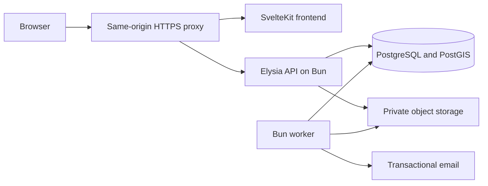

# Technical specification: Grassroots place social app

Status: Implementation design, 2026-09-12. This document specifies work to build; it does not claim the application is implemented. Product behavior is defined in [PRD.md](PRD.md).

## 1. Existing code and architecture decision

The repository currently has a SvelteKit/Svelte frontend with Tailwind, Vitest, and Playwright, and a Bun/Elysia backend. `apps/backend/src/index.ts` serves a greeting on port 3000; `apps/backend/index.ts` is an unused greeting scaffold. There is no application database, authentication, or product implementation yet.

Keep the existing frameworks. Use a modular backend, one PostgreSQL database with PostGIS, private S3-compatible object storage, and a Bun worker backed by database jobs. Serve the SvelteKit frontend using its Node adapter behind the same HTTPS origin as `/api/v1`. This deployment needs a future adapter configuration change from the current auto adapter. SvelteKit documents the standalone Node deployment in its [adapter-node documentation](https://svelte.dev/docs/kit/adapter-node).

Use Bun's native SQL client with parameterized queries and explicit SQL migrations. Bun documents pooling and transactions in its [SQL API](https://bun.sh/docs/runtime/sql). Use Elysia request/response schemas for runtime validation and contract types, following its [validation documentation](https://elysiajs.com/essential/validation). Choose exact dependency/runtime versions when implementing, pin them in the lockfile and deployment images, and verify them in CI; do not independently upgrade the scaffold as part of documentation work.



No Redis, search cluster, microservices, external map catalog, or WebSocket service is required for MVP. SQL supports place search, jobs, rate limits, and sessions. The first release uses list-based geographic discovery with numeric map-center inputs and named-area search; an interactive map provider is optional later.

## 2. Repository organization and boundaries

```text
apps/backend/src/
  index.ts                 # environment, app assembly, server startup
  app.ts                   # testable app factory
  modules/
    identity/              # users, sessions, profiles, roles
    places/                # directory, claims, membership, merges
    publishing/            # visits, posts, comments, revisions, eligibility
    evidence/              # checks, receipt review, expiry
    discovery/             # following, nearby, saves, preferences
    guides/                # ordered entries and source invalidation
    conversations/         # merchant grants, corrections, messages
    moderation/            # reports, actions, appeals, account deletion
    advertising/           # staff-managed campaigns and slots
  infrastructure/          # SQL, storage, mail, clock, jobs
  worker.ts
apps/frontend/src/
  routes/                  # page loading and forms
  lib/features/            # components and client state by feature
contracts/                 # OpenAPI contract, API schemas, and DTO types
migrations/                # ordered SQL migrations
```

Each backend module exposes commands/queries through a service interface. Routes validate input and identify the actor; services own authorization, state changes, and transaction boundaries. Other modules call that interface rather than writing another module's tables. Cross-module transactions pass the same SQL transaction object. Tests can replace clock, email, and storage adapters; database behavior is tested against real PostgreSQL/PostGIS.

## 3. Data model

Use UUID primary keys, `timestamptz` for instants, local `date` plus optional `time` for visits, integer minor units for money, currency codes, and explicit foreign keys. All mutable user content has a monotonically increasing `version`. Public identifiers never grant access by themselves.

| Table/group | Key fields and constraints |
| --- | --- |
| users, profiles | Unique normalized email; unique case-insensitive handle; display name; active/suspended/deleting/deleted; public profile separated from private email |
| auth_challenges, sessions | Keyed code digest, expiry, attempts; session-token digest, user, idle and absolute expiry |
| merchant_organizations | Display name, approved status; does not authenticate independently |
| merchant_memberships | Organization + user unique; owner/staff; active/revoked; actor permission set |
| place_claims | Place, organization, claimant, pending/approved/rejected, private evidence asset, reviewer and decision |
| places | Name, normalized address, country, category, cuisines, `geography(Point,4326)`, IANA timezone, location_version, location_approved, community/open/closed/merged state, canonical target, predecessor |
| place_corrections | Proposed field patch, submitter, status, deciding staff |
| posts | Kind visit/update/merchant_update; reviewer author or merchant organization and acting user; place; body; draft/published/hidden/deleted; version; published_at |
| visits | Post PK/FK; local date, optional time, timezone snapshot, rating 1..5, context, order total/currency, party size, conflict status, eligibility_hold (none/duplicate_pending), dedupe_active; author/place copied with a composite FK to the parent post |
| post_revisions | Post + version unique; changed public fields, actor, reason; private time/evidence never serialized publicly |
| rating_contributions | Visit PK; canonical place; rating 1..5; only currently eligible visits have a row |
| place_rating_stats | Place PK; sum, count, five bucket counts; maintained in same transaction as contributions |
| verification_challenges | Random challenge, owner, draft visit, place version, expires_at, consumed_at; no submitted device coordinates |
| location_checks | Visit, owner, result, server checked_at, local check date, approved place version, policy version, attached_at/revocation reason |
| receipt_checks | Visit, asset, pending/approved/rejected/expired/revoked; keyed file fingerprint; extracted checked fields; bound-field digest; reviewer and decision time |
| media_assets, post_media | Owner, purpose, private storage key, MIME/size, upload/processing/ready/rejected/deleted state; parent ownership association |
| follows, saves | User + target unique; saves use a target discriminator with typed FK columns and exactly-one-target constraint |
| preferences, areas | Cuisine IDs, budget amount/currency, radius; saved named area; areas have public center and timezone, admin-maintained or derived from confirmed places |
| comments | Post, user, optional merchant organization, parent, body, visibility; same-post parent enforced |
| guides, guide_entries | Author, status, version, title; ordered unique positions; source visit, entry advice, source status; source must belong to author |
| guide_saves | User + guide unique; last_seen_version; live reference |
| merchant_contact_grants | Reviewer + organization unique; granted/revoked time |
| conversations, messages | One reviewer/organization pair; sender actor, body, state; no attachments |
| correction_requests | Report, organization, requested fields and reason, open/accepted/declined/closed; one open per pair |
| blocks | Blocking user; blocked user or organization, exactly one; unique per pair |
| reports, moderation_actions, appeals | Typed target, reason, actor; append-only action and decision metadata; appeal unique per action |
| campaigns | Organization, managed place, creative asset, start/end, country/area radius, enabled, staff owner |
| notifications | Recipient, type, target, read_at; payload contains IDs rather than copied user content |
| jobs, idempotency_keys | Unique deduplication key; available_at, lease, attempts; actor/route/key/hash and retained response reference |
| feed_snapshots | Owner/session, ordered post IDs, campaign slot IDs, offset, expires_at; no raw search coordinates |
| deletion_requests | Subject, requested_at, stage, purged_at, restore-suppression identifier |

Add indexes on places.location (GiST), normalized place name/address for search, posts(place_id,status,published_at,id), posts(author_id,status,published_at,id), follows(follower_id,followee_id), contributions(place_id), comments(post_id,created_at,id), messages(conversation_id,created_at,id), pending queues(status,created_at), and due jobs(available_at). Use a partial unique index on visits(author_id, place_id, local_date, local_time) where dedupe_active and local_time is not null. Drafts, deleted reports, and merge-held duplicates have dedupe_active=false; published and moderator-hidden reports otherwise remain true. A merge sets the duplicate hold before changing its canonical place. Date-only exclusivity needs a transaction lock as described below.

## 4. Identity and authorization

Email sign-in uses a six-digit one-time code expiring in ten minutes, with five attempts per challenge, at most three issue requests per email per hour, and a separate IP-based hourly limit. Store a keyed digest, never the code. Issue/verify responses do not disclose whether an account already exists. Each new challenge invalidates prior active challenges for that address. Consume code and create/rotate the session atomically.

Session tokens are random 256-bit opaque values. Store only their digest. Use a Secure, HttpOnly, SameSite=Lax cookie, seven-day idle expiry and thirty-day absolute expiry. Reject state-changing requests with a foreign Origin and require a CSRF token. No session token in browser local storage. Reauthenticate account deletion and merchant ownership transfer with a new email challenge. Staff accounts require TOTP enrolled through a controlled staff invitation before access to private evidence and administrative actions. Encrypt the TOTP secret at rest, reject reused time steps, and store only digests of single-use recovery codes.

Email verification establishes access to the email address, not a real-world identity. Public browsing is available anonymously; posting, following, saving, reporting, and conversations require a session. Enforce account state and membership on every mutation and every private read.

| Operation | Authorized actor |
| --- | --- |
| Edit/delete report | Its reviewer, or moderator hide/purge action; merchants cannot edit |
| Publish merchant update/reply | Active member of the organization managing that place |
| Read/send business messages | Reviewer or active organization member with messaging permission; active contact grant for sending |
| Claim/transfer place | Claimant submits; unrelated staff approve; owner accepts transfer |
| Review receipt | Assigned authorized staff, not submitter or related merchant |
| Create campaign | Platform staff for approved merchant and its managed place |
| View public content | Public, with per-view authenticated block filtering; private fields absent from DTO |

Organization member removal invalidates access immediately. Approval of a merchant membership runs the rating-conflict update before returning success. Membership revocation does not automatically restore suppressed self-ratings.

## 5. Publication and aggregate consistency

Creating a report starts with a draft, enabling optional evidence before publication. Validate text, media readiness, canonical place, local date/time, rating, and spending fields on publish. Future local dates are rejected; historical visits are allowed without location confirmation. All public text is rendered as escaped text; no arbitrary HTML.

All publication mutations take a shared account advisory lock (account deletion and membership conflict updates take it exclusively), then affected canonical place row locks in UUID order, then advisory locks keyed by `(reviewer, canonical_place, local_date)`, then post row locks. On create or changes to place/date/time, acquire old and new date keys in sorted order before checking date-only conflicts and same-minute duplicates. Place merges take their place locks first and therefore exclude concurrent publication into either place; they do not acquire account locks afterward. Concurrent publishes cannot both pass the exclusion check. Return `409 DUPLICATE_VISIT` with a link to the user's existing report. Different same-day visits remain valid when distinct times are supplied.

Idempotency keys prevent retry-created reports independently of duplicate rules. Initial limits: 10 published visits per user per UTC day, 30 short/merchant updates per user per UTC day, 60 comments per hour, 30 sent messages per hour. These are server settings, not client-only limits. Read throttling uses a token bucket equivalent backed by expiring SQL counters for MVP.

Every eligibility mutation runs one transaction:

1. Acquire the account/place/date/post locks in the order above, then lock the existing contribution. Recheck canonical redirects and versions after locks; retry if canonicalization changed the required lock set.
2. Validate actor, optimistic version, duplicates, and conflict status.
3. Write content/revision/evidence changes.
4. Remove the previous contribution and decrement its old aggregate, then insert a new eligible contribution and increment the new aggregate. Updating an unchanged contribution is a no-op.
5. Set guide-entry availability, increment affected guide versions, and unpublish guides with zero usable entries. Enqueue ID-only notification/media cleanup work in the same transaction.
6. Commit and return the new version and current aggregate.

Use a shared eligibility function: published post + active author + no moderation removal + no known self-interest conflict + no duplicate hold. Receipt/location status does not affect eligibility. Public statistics are calculated from contributions, never client values. Unique reviewer count and context-filtered aggregates are SQL queries over eligible contributions joined to visits. Show mean `sum/count` rounded only for display, and return null when count is zero.

Moderator removal, reinstatement, membership approval, account suspension, deletion, and place merge use the same contribution service. Daily reconciliation compares cached stats to contributions and alerts/repairs discrepancies. PostgreSQL describes row and transaction lock behavior in its [locking documentation](https://www.postgresql.org/docs/current/explicit-locking.html).

For a place merge, lock both place rows in order, canonicalize reports, claims, campaigns and guide destinations, and resolve date-only or same-minute collisions under the duplicate policy. Keep the older report contributing, mark the other as duplicate_pending excluded from aggregates, notify the author, and allow staff to establish separate visits. Transfer an approved organization only if there is no competing approved claim; otherwise pause the merge until staff resolve ownership. All future writes resolve the redirect inside their transaction.

## 6. Verification protocol

### Location

1. `POST /visits/:id/location-challenges` requires the draft/report owner, approved venue metadata, and an owned draft or published visit with a selected date; rating eligibility is not required. Return a single-use random challenge bound to owner, visit, place version, expiring in two minutes.
2. Browser requests location only after a deliberate user action. Submit challenge, latitude, longitude, accuracy, and device timestamp over HTTPS. Reject nonfinite/out-of-range coordinates, future timestamps more than five seconds ahead, readings older than 60 seconds, and accuracy over 50 meters.
3. Compare server time, place timezone, visit date and optional local time. The check date must match the visit date; supplied time must be within two hours. Resolve DST ambiguity by considering both legal instants on that local date; nonexistent local times fail validation. A client timestamp is only a freshness signal, never authoritative visit evidence.
4. Use `ST_DWithin(place.location, submitted_point, 100)` on geography. PostGIS defines geography distance parameters in meters in its [ST_DWithin documentation](https://postgis.net/docs/ST_DWithin.html).
5. In one transaction acquire place then post locks and lock/consume the challenge, recheck post version and place location_version, and write only result, server check time, local check date, place version, and policy version. A concurrent replay fails. Never persist latitude, longitude, accuracy, or device timestamp in a table or job.
6. A check has to attach to publication within seven days of server check time. Unattached checks/drafts expire after seven days. Once attached, the evidence persists with the report until invalidated or deleted. Public DTO exposes type and state, not exact server time.

Disable request/response body logging for location routes across proxy, application, tracing, error reporting, and development logging. Nearby search likewise uses a POST body without coordinate logging. Outcome counters are allowed without coordinates or exact visit time. Venue coordinates are public directory data and may be stored; they are not device history.

Browser location can be spoofed. No identity or anti-spoofing guarantee is asserted. A stale reading, denied permission, unapproved venue, low accuracy, expired check, or server failure returns a recoverable state and never blocks an otherwise valid unverified post.

### Receipts and upload lifecycle

An authenticated owner creates an upload intent with purpose and expected size/type. Issue a random private staging key with a short-lived upload URL. Signed URLs are bearer access and may be reusable until expiry, so upload keys never equal final asset keys. After completion, check actual size/type, decode the image, strip metadata, reject invalid files, copy sanitized output to a server-only final key, and discard the staging object. An attacker overwriting a still-live staging URL cannot change approved output. AWS documents signed URL access and expiry in its [S3 documentation](https://docs.aws.amazon.com/AmazonS3/latest/userguide/using-presigned-url.html).

Public photos are served by an authenticated-to-content media gateway that rechecks parent visibility (public viewers can read public parents). All underlying buckets stay private. Responses use short cache lifetimes and deletion invalidates managed caches; downloaded copies cannot be recalled. Receipt images use staff-only access and `Cache-Control: no-store`, never the public photo gateway.

Receipt review states: pending -> approved/rejected; pending -> expired at seven days; approved -> revoked on bound-field change or moderation; replacement creates a new check and withdraws the old pending check. Approval locks the post and check, verifies the bound-field digest, and records checked venue/date/amount/currency/items. If bound fields changed, return `409 EVIDENCE_STALE`; staff can reload and review the new claimed fields, but the original seven-day expiry does not reset. A receipt without an assessable venue/date cannot receive a visit-bound badge; request a better image.

Store amounts in currency-aware minor units and validate currency exponent against an application currency table. Compute a keyed exact-file fingerprint while processing. A unique active fingerprint prevents reuse across visits until that evidence is deleted. Do not claim this prevents transformed-image fraud.

After a final decision, enqueue raw receipt deletion due within 24 hours. Expiry triggers immediate badge-free state and deletion. Staff cannot open expired assets even if a storage job is delayed. Approved checked fields remain; deleted raw images cannot be used for later reinspection, so a challenge requiring reinspection requests fresh evidence. Alert if any overdue raw receipt remains in storage. Claim evidence uses the same private lifecycle: delete within 24 hours of decision or seven days pending.

## 7. Feed queries and geographic behavior

Following uses keyset pagination `(published_at,id)` descending, filters active public reviewer posts from followees, and excludes blocked parties. Merchant content is on the corresponding place page, not inserted into Following. No follows or no posts produces an explicit empty view with a Nearby link.

Nearby first applies canonical open/community place + radius + post visibility and block filters. Consider public reviewer posts from the past 90 days. Assign tiers: 0 followed reviewer; 1 cuisine or budget match; 2 remaining community. Within tiers sort by distinct non-author saves in the last seven days descending, publication time descending, then UUID. Distinct saves are counted per saving account and post. All accounts use the same rule; follower count and ad spend are absent.

Read a bounded candidate set of 1,000 per search, select up to 200 results applying two-per-author per 20-item page, and persist only ordered IDs in a 15-minute snapshot scoped to the user/session. Unknown spending does not produce a budget match; one matching explicit preference is sufficient. If diversification prevents filling a page, show a shorter page. Label the result as recent activity, not a complete historical search. Place search remains available for the directory and older reports remain on place pages.

A continuation token is signed and refers to snapshot + next offset; raw search coordinates are never in it. On every page, recheck visibility, blocks, and account state; skip now-ineligible IDs without duplicating delivered ones. Changed preferences/radius starts a new snapshot; expiry returns `410 FEED_EXPIRED` with Refresh. Anonymous snapshots use a short-lived random session identifier.

Place search normalizes names and addresses and optionally filters geography. It supports manual area selection without a third-party geocoder: derive named areas from approved directory entries and let users enter a geographic center when an area is not cataloged. A lightweight optional interactive map can be added later without changing API semantics.

Ad selection happens after organic ranking. Choose an active campaign within both campaign targeting and the viewer search radius; rotate deterministically across eligible campaigns. Inject at organic offsets 10 and 20 only when enough organic items exist. Do not substitute an ad for a removed organic post or show ads for blocked merchants/closed places. Recheck eligibility on page read. Persist campaign IDs in the snapshot to keep pagination stable. Record aggregate campaign/day counts; no behavioral profile or external tracking pixel.

## 8. API contracts

All routes use `/api/v1`, JSON, schema validation, and server-derived actors. Dates use ISO date strings, instants ISO UTC strings, amounts integer minor units, and entity versions integers. Return `{data, nextCursor?}`; errors return `{error:{code,message,fields?,requestId}}`. Use 401/403 for access, 404 to hide private resources, 409 for conflicting state, 422 for invalid input, 429 with Retry-After for limits, and 503 for recoverable dependencies.

Mutation retries use `Idempotency-Key` for creation, publication, evidence completion, messages, and deletion requests. Retain actor + route + key + request hash + result reference for 24 hours. Same key with another body returns 409. `If-Match` carries entity version on edits; stale writes return 409 with current version. Do not include raw coordinates or receipt bytes in idempotency storage; location replay is controlled by its one-time challenge.

| Route family | Required operations |
| --- | --- |
| `/auth/challenges`, `/auth/sessions` | Issue/consume sign-in code, revoke session; challenge purpose binds reauthentication actions |
| `/me`, `/profiles/:handle` | Read/update profile/preferences; deletion request requires fresh reauthentication |
| `/places`, `/places/search` | Create, list/search, detail; create requires location/address/timezone; search accepts optional center |
| `/places/:id/corrections`, `/claims` | Submit and view own correction/claim; staff decide via admin routes |
| `/organizations/:id/members` | Owner invites/removes staff; server checks approved place ownership separately |
| `/posts`, `/posts/:id`, `/posts/:id/publish` | Draft/create/read/edit/delete, publish typed content; visit fields required for visit kind |
| `/visits/:id/location-challenges`, `/location-checks` | Bound one-time challenge and submission |
| `/uploads`, `/uploads/:id/complete`, `/visits/:id/receipts` | Create staging intent, validate/process, attach private evidence |
| `/feeds/following`, `/feeds/nearby` | GET Following cursor; POST Nearby center/preferences/snapshot cursor |
| `/follows/:userId`, `/saves` | Idempotent follow/unfollow and typed private saves |
| `/posts/:id/comments`, `/comments/:id` | Create threaded reply, read, owner edit/delete |
| `/guides`, `/guides/:id`, `/guides/:id/publish` | Draft, entries, reorder, publish, live version and unavailable sources |
| `/merchant-contact/:organizationId` | Grant/revoke permission and initiate conversation |
| `/conversations/:id/messages` | Cursor-based read/send; permission rechecked on every send/read |
| `/posts/:id/correction-requests` | Merchant request, reviewer accept/decline; acceptance itself does not mutate review |
| `/blocks`, `/reports`, `/appeals` | Block/unblock, submit typed report, appeal an eligible action |
| `/notifications` | Cursor read and mark read; client polls while visible |
| `/admin/*` | Claims, place metadata/merges, receipts, reports/actions/appeals, campaigns, overdue jobs |

Representative visit publish request:

```json
{
  "version": 3,
  "body": "Lunch visit and ordering advice.",
  "visit": {
    "localDate": "2026-09-12",
    "localTime": "12:30",
    "rating": 4,
    "mealPeriod": "lunch",
    "orderTotalMinor": 120000,
    "currency": "IDR",
    "partySize": 2
  },
  "photoAssetIds": [],
  "locationCheckId": null
}
```

Place ID is already bound to the draft; a move is a versioned edit. Money in this example represents schema shape, not a recommended price. Publication accepts ready owned photos only, and evidence ID must belong to this visit and actor. Public DTO omits localTime, raw evidence, session data, and email.

## 9. Guides, conversations, and deletion

Guide entry edits lock the guide and source visit. Require author's active published source and unique positions; reorder all positions atomically. Up to 30 entries, at least one usable source to publish. Saves reference guide ID and last_seen_version. Source deletion/hiding marks the entry unavailable and clears public source-derived details in the same transaction as report removal. Authors may retain their own guide advice privately until replacement. Published pages expose only unavailable placeholders for those slots.

A closed venue remains a usable source with a visible closure warning and is omitted from suggested active-stop counts. A guide with no published sources is unpublished. Deleting a guide does not delete its source visits. Account deletion removes authored guides and invalidates saves with Guide unavailable; it does not preserve a copied snapshot.

Conversation reads require participant status; sends additionally require active merchant grant, active membership, and no block. Lock the grant row when sending or revoking so a message cannot commit after revocation wins the lock. Client polling is 30 seconds only when the page is visible. Block operations also cancel pending notifications from the blocked actor; workers recheck permission before delivery. Replies under a merchant identity display the organization, with acting-user ID retained privately for audit.

Deletion immediately sets account status to deleting, revokes sessions, and filters all public queries by active author. Within the deletion transaction remove contributions, invalidate guides, hide comments/messages, and enqueue purge jobs. Take an account-level write lock and complete the visibility and contribution changes in one transaction before acknowledging deletion. The endpoint has a 30-second transaction budget and is excluded from the ordinary write latency target. A timeout rolls back and returns a retryable error; idempotency prevents repeating a committed request. Media and body purging remain asynchronous.

Deletion jobs purge content bodies, revisions, checked receipt fields, image objects, grants, sessions, snapshots, private preferences, and personally linked notifications within 30 days. Retain only a content-free tombstone ID where referential integrity requires it. Stored recipient views of authored messages become Message removed. Object deletion is retried and verified. Security/action logs expire after 30 days and do not contain content bodies or raw evidence.

Keep an independent encrypted deletion journal of opaque subject IDs for 40 days, longer than the 35-day backup retention. Before any restored database serves traffic, replay that journal and purge affected rows/assets. Restore rehearsal must demonstrate that deleted accounts do not reappear. Once backup retention has passed, expire journal identifiers. Do not use a full object-storage backup policy that silently outlives these deletion windows.

## 10. Workers, operational controls, and deployment

Jobs live in PostgreSQL and are inserted with the related mutation. Workers claim due jobs with row locks and skip locked rows, record a five-minute lease, and renew long tasks. Work is at-least-once: handlers use stable deduplication keys and idempotent storage deletes/notification writes. Retry after 1 minute, 5 minutes, 30 minutes, 2 hours, and 12 hours; then dead-letter and alert. Critical purge jobs continue daily retries after alert until resolved.

Required jobs: image sanitization, raw receipt/claim expiry and purge, account purge, evidence reassessment queue, notifications, aggregate reconciliation, expired auth/feed/idempotency cleanup, and retention enforcement. Staff dashboard shows pending age, failures, and backlog. Automated jobs never approve claims, receipts, or appeals.

Deployment consists of frontend, API, worker, PostgreSQL/PostGIS, private object storage, and SMTP delivery under a single public HTTPS origin. Local development uses containers for PostgreSQL/PostGIS, an S3-compatible emulator, and a mail catcher. Environment contract: DATABASE_URL, APP_ORIGIN, object endpoint/buckets/credentials, SMTP settings, session/code/fingerprint signing secrets, and worker role. No real credentials belong in the repository.

Use migrations with a schema_migrations table, checksums, and a deployment lock. Apply backward-compatible schema additions before application deployment; backfill separately before enforcing new constraints. Run the backend from src/index.ts consistently; remove or repurpose the unused root greeting in the implementation phase. Serve `/health/live` for process liveness and `/health/ready` for database/schema readiness. A mail/storage outage disables the dependent operation with retry guidance, not unrelated read paths.

Proposed technical acceptance targets: API read p95 under 500 ms and write p95 under 1 second, excluding external email/upload/manual review, at 50 concurrent active clients against 10,000 places and 100,000 reports. Nearby snapshot creation p95 under 1 second. Treat these as load-test targets, not existing measurements. Use pagination and query plans before introducing extra infrastructure.

Production logs contain request ID, route template, status, duration, and coarse error code. Do not log auth codes, cookies, request bodies, messages, receipt URLs, coordinates, or uploaded image metadata. Metrics include latency, error rates, queue age, overdue deletion counts, aggregate drift, verification failure categories, and abuse volume. Restrict staff access and audit private evidence reads.

Back up PostgreSQL daily with point-in-time recovery where supported; target recovery point <=24 hours and recovery time <=4 hours for the pilot. Verify actual hosting support and demonstrate restoration before release. Hosting accounts and credentials are deployment inputs, not unresolved product rules.

## 11. Implementation phases and verification

| Phase | Build | Exit evidence |
| --- | --- | --- |
| 1 | SQL migrations, identity, contracts, storage adapters, staff access | Sign-in, ownership, migration and session tests against real services/emulators |
| 2 | Places, claims, visits, contributions, edits/deletion | Concurrent duplicate publication, repeat visit, merge, self-rating and average tests |
| 3 | Location and receipt evidence, media lifecycle | Replay/stale/wrong-actor tests, coordinate-log audit, raw receipt expiry and sanitized-upload tests |
| 4 | Following/Nearby, saves, comments, guides | Deterministic pagination, radius boundaries, blocks, source deletion and live-guide tests |
| 5 | Merchant contact, reports/appeals, campaigns, notifications | Revocation race, role transfer, moderation reinstatement, independent ad-slot tests |
| 6 | Full account purge, retention/restore, accessibility and load checks | Restore rehearsal, keyboard flows, empty/error cases, load targets and staffed queues |

Use Bun tests for backend rules and PostgreSQL integration tests for constraints/transactions; retain existing Vitest and Playwright for frontend and full flows. Key cases:

- Same-day distinct visits count separately; concurrent same-minute/date-only conflicts reject; retries return the original result.
- Rating edits, hides, restores, merchant membership, merges, and account deletion never leave stale aggregates.
- A check cannot attach across reviewer/place/date, replay, survive invalidating edits, or expose raw coordinates. Test midnight and DST cases.
- Invalid media cannot become public; a reused staging URL cannot replace an approved final asset; receipt approval racing a report edit fails safely.
- Receipt amount/currency edits revoke only relevant evidence; pending expiry and purge retry leave no public or staff access to expired images.
- Nearby is inside radius including dateline cases; Following can contain distant posts; empty areas and unknown currency are explicit.
- Snapshot continuation skips newly hidden/blocked content; ads do not perturb organic rank and cannot show blocked merchants.
- Guide deletion, source removal, closure, replacement, and account deletion preserve valid public states.
- A blocked/revoked merchant cannot message through a direct API call or race; staff removal prevents old session access to organization messages.
- Purge worker failure retries without re-exposing content; restored backups honor the independent deletion journal.

Contract tests verify that all public DTOs omit private fields. Playwright covers permission denied, manual location, no results, pending receipt, unavailable guide, stale edit, session expiry, and upload failure with keyboard access and readable status messages.

## 12. Frontend routes and behavior

| Route | Screen and required states |
| --- | --- |
| `/` | Following/Nearby tabs, named area/manual center, radius and preferences; empty/expired snapshot and retry states |
| `/sign-in` | Email and code steps; expiry, retry limits and generic delivery response |
| `/places/new`, `/places/[id]` | Directory creation with duplicate warning; details, averages, context filters, recent reports, business updates, closure state |
| `/compose`, `/posts/[id]` | Typed draft, date/time, rating, media progress, opt-in evidence controls, publication; report detail, comments and edit history |
| `/people/[handle]`, `/saved` | Public contributions/follow action and private saved content |
| `/guides/new`, `/guides/[id]` | Ordered author-owned sources, practical tips, version changes, source unavailable and closure states |
| `/merchant` | Organization switcher, claims, managed places, updates, correction requests and permitted conversations |
| `/messages/[id]`, `/notifications` | Text thread, merchant identity, contact permission/revocation and polling states |
| `/settings` | Profile/preferences, blocks, merchant contact grants and account deletion |
| `/admin` | Staff-only claim/receipt/moderation/appeal/campaign queues, assignments, decisions and worker failures |

SvelteKit loads public pages through public DTOs and authenticated pages through session-aware server calls. Forward only the relevant session cookie to the same-origin backend; never serialize private service responses into public page data. Keep publishing/evidence operations pending until server success. Optimistic follow/save updates must roll back on failure; ratings, evidence badges, permissions, and deletions never display optimistic success.

Draft forms retain unsaved text in component memory across recoverable errors and warn before leaving. Persist a server draft explicitly; never put receipts or exact location into browser storage. Reorder guides using keyboard-accessible move-up/move-down controls as well as drag support if added. Every form has field labels, visible focus, inline errors, a status announcement, and loading/empty/failure states. Mobile layouts must work at 360 px without horizontal scrolling. Uploaded photo alt text is editable; decorative images use empty alt text. No native-app permission assumptions are used.

## 13. Review-finding resolution map

| Finding | Product resolution | Technical location |
| --- | --- | --- |
| Place lifecycle missing | PRD 4 | Directory schema, merges, API and phase 2 |
| Verification time binding | PRD 6 | Section 6 protocol and edit invalidation |
| Repeated ratings/spam | PRD 5 | Section 5 locks, contributions and limits |
| Following/proximity conflict | PRD 4 | Section 7 feed selection and pagination |
| Undefined social objects | PRD 5 | Section 3 typed entities and section 8 contracts |
| Merchant/account permissions | PRD 3 | Section 4 authorization and conflict updates |
| Context and spending ambiguity | PRD 5 | Visit timezone/money fields and receipt binding |
| Guides after edits/deletion | PRD 7 | Section 9 source state and live saves |
| Moderation/contact placeholder | PRD 8 | Sections 4, 8 and 9, phase 5 |
| MVP overstatement | PRD 2 | Lightweight complete scope and phased delivery |
